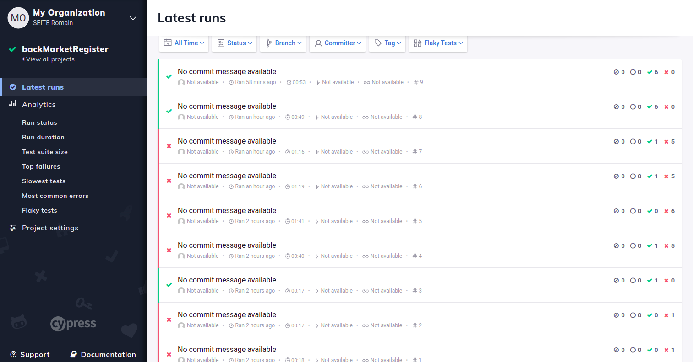

# backMarketRegister

Cypress end-to-end test project about registering on [preprod.backmarket.fr](https://preprod.backmarket.fr/register) using the register page. [preprod.backmarket.fr/register](preprod.backmarket.fr/register)

Author: Romain SEITE

Tools used : Github, Cypress, Git, VSC, Chrome

## Index

* [**Scenarios**](cypress/integration/register.feature) : register test scenarios in Gherkin. They are found in cypress/integration

* [**E2E tests**](cypress/integration/register.spec.js) : automated register tests in Javascript. They are found in cypress/integration

* [**Video**](#Video) : video of the tests automated with Cypress. They are found in cypress/videos in both .mp4 and .gif

* [**Screenshots**](#Screenshots) : screenshots of the dashboard and of the report of the 6 tests E2E. They are found in cypress/screenshots

- - - - - - - - - - - - - - - - - - - - - - - - - - - - - - -

### Scenarios :

**Feature: Register**
    **Background: User on Register Page**
    
**Scenario: Successful Register**

        Given correct credentials
        
        When registering
        
        Then the user should be connected
        
        And the user should be redirected to his shopping cart
        
**Scenario: Email Already in Use**

        Given correct credentials
        
        But the email is already in use
        
        When registering
        
        Then an error "email already in use" should appear
        
        And the user can't register

**Scenario: Wrong Email**

        Given correct credentials
        
        But an invalid email
        
        When registering
        
        Then an error "email invalid" should appear
        
        And the user can't register

**Scenario: No First Name**

        Given correct credentials
        
        But no first name
        
        When registering
        
        Then an error "please fill out this field" should appear
        
        And the user can't register

**Scenario: No Last Name**

        Given correct credentials
        
        But no last name
        
        When registering
        
        Then an error "please fill out this field" should appear
        
        And the user can't register
    
**Scenario Outline: Wrong Password**

        Given correct credentials
        
        But the password hasn't "<condition>"
        
        When registering
        
        Then an error "please type a correct password" should appear
        
        And the user can't register

   **Example**: 
| **condition** |
| :----------- |
| 8 characters |
| 1 lower case |
| 1 upper case |
| 1 number     |

- - - - - - - - - - - - - - - - - - - - - - - - - - - - - - -

### Video

Video of the tests :

- - - - - - - - - - - - - - - - - - - - - - - - - - - - - - -

### Screenshots

**Dashboard** :

You can see I started with 1 test and waited it to work fine before writing all tests

**Report** :

- - - - - - - - - - - - - - - - - - - - - - - - - - - - - - -
